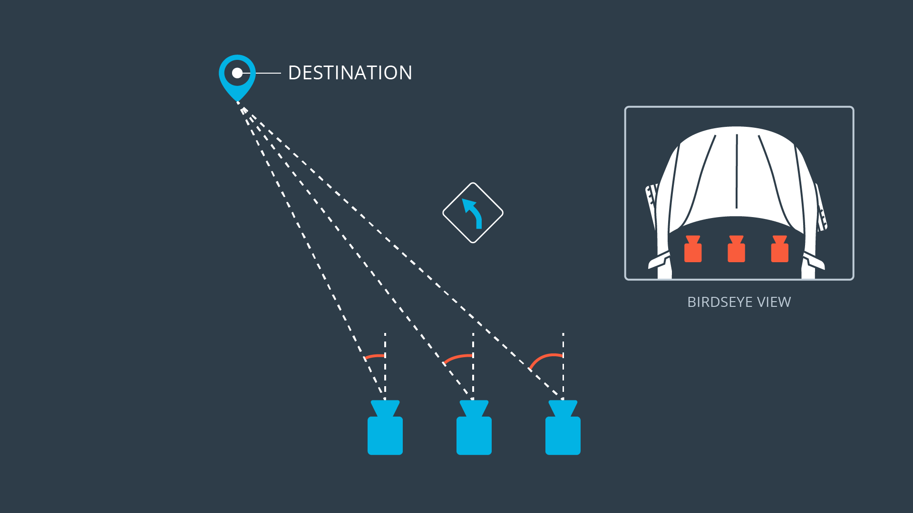

# Behavioral Cloning

Overview
---
In this project, deep neural networks and convolutional neural networks are used to clone driving behavior. Training, validation and testing the model is done by using Keras. The model outputs a steering angle to an autonomous vehicle.

The implementation is done via a [simulator](https://github.com/udacity/CarND-Term1-Starter-Kit) where you can steer a car around a track for data collection. Image data and steering angles are used to train a neural network and then use this model to drive the car autonomously around the track.

The goals / steps of this project are the following:
* Use the simulator to collect data of good driving behavior
* Build, a convolution neural network in Keras that predicts steering angles from images
* Train and validate the model with a training and validation set
* Test that the model successfully drives around track one without leaving the road

### Model Architecture and Training Strategy

#### 1. Model Architecture

The model consists of a convolution neural network inspired in the nVidia [architecture](https://images.nvidia.com/content/tegra/automotive/images/2016/solutions/pdf/end-to-end-dl-using-px.pdf)

| Layer | Description |
| :-----: | :-----------: |
| Input | 320x160x3 RGB image | 
| Cropping | 320x75x3 RGB image |
| Convolution 5x5 | 24 kernels, 2x2 stride, ReLU activation |
| Convolution 5x5 | 36 kernels, 2x2 stride, ReLU activation |
| Convolution 5x5 | 48 kernels, 2x2 stride, ReLU activation |
| Convolution 3x3 | 64 kernels, 1x1 stride, ReLU activation |
| Convolution 3x3 | 64 kernels, 1x1 stride, ReLU activation |
| Flatten |   |
| Fully connected | Output 100, ReLU activation |
| Dropout | keep_prob : 0.5 |
| Fully connected | Output 50, ReLU activation |
| Dropout | keep_prob : 0.5 |
| Fully connected | Output 1 |

The model includes RELU layers to introduce nonlinearity, and the data is normalized in the model using a Keras lambda layer. 

#### 2. Attempts to reduce overfitting in the model

The model contains dropout layers in order to reduce overfitting. 

The model was trained and validated on different data sets to ensure that the model was not overfitting. It was tested by running it through the simulator and ensuring that the vehicle could stay on the track.

#### 3. Model parameter tuning

The model used an adam optimizer, so the learning rate was not tuned manually.

#### 4. Creation of the Training Set & Training Process

This is done by capturing all the images during a manual driving mode session in the provided [simulator](https://github.com/udacity/CarND-Term1-Starter-Kit). 

The images are originated from 3 front cameras:
* A centered one
* A left sided one
* A right sided one

They are all parallel but are located with a certain offset among each other.
This setup provides fundamental knowledge to the model in order to actuate in case the car deviates from the road.

#### 5. Appropriate training data

Training data was chosen to keep the vehicle driving on the road. Recording a single lap was enough to make the performance to work fine. In addition to the gathered image dataset, data augmantation has been applied to incorporate additional data. This was an important step because most of the curves during the lap were driven towards to the left. This fact tends to create a biased model to the left which is compensated by augmenting the data via mirroring or flipping the images and their correspondent steering angles.

Besides, it is extremely important to drive the car during the training with the mouse or a joystick because by using the keyboard introduces function steps that the model does not cope with properly.

Then the data is split following the pareto rule: training set (80 %) and validation set (20 %).

#### 6. Solution Design Approach

From the original nVidia [architecture](https://images.nvidia.com/content/tegra/automotive/images/2016/solutions/pdf/end-to-end-dl-using-px.pdf), the model was adapted to the case so that:
* dropout methods are applied after every hidden fully convolutional layer in order to prevent overfitting
* images fed to the pipeline are cropped at the beginning so that some upper and lower portion of the images are removed since they are not relevant for the training

Then 2 epochs are enough to train the model properly without overfitting and demonstrates a good performance on behavioral clonning.

Final Result
---
In the best case scenario, the autonomous car will drive as good as the trained car.

[Video](./run1.mp4)
