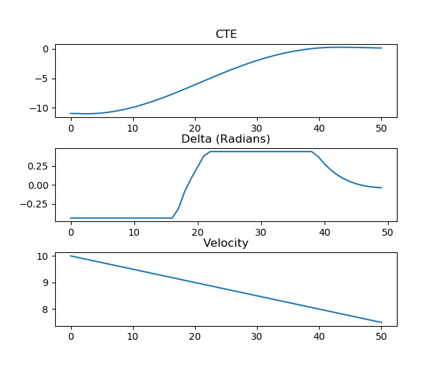
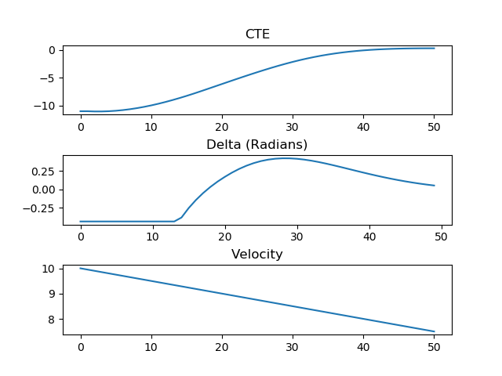
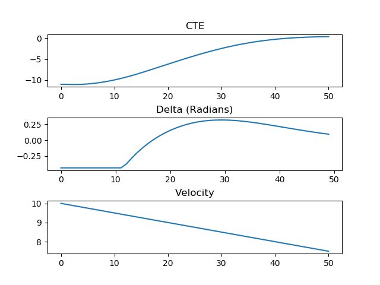

# CarND Controls Quizzes

Quizzes for *Vehicle Models* and *Model Predictive Control* sections.

1. [Global Kinematic Model Quiz](./global_kinematic_model) - Implement the *Global Kinematic Model*.
2. [Polynomial Fitting Quiz](./polyfit) - Fit and evaluate polynomials.
3. [Mind The Line Quiz](./mpc_to_line) - Implement MPC and minimize cross track and orientation errors to a straight line trajectory.  See [this document](https://github.com/udacity/CarND-MPC-Quizzes/blob/master/install_Ipopt_CppAD.md) for setup tips for executing the plotting code in the ```MPC.cpp``` solution file.

To do a quiz:

1. Go to quiz directory.
2. Make a build directory with `mkdir build`.
3. Change into the build directory, `cd build`.
4. Compile the project, `cmake .. && make`.

A solution for each quiz is presented in the solution directory.

## Dependencies

The *Global Kinematic Quiz* and *Polynomial Fitting* quizzes have all the dependencies in repo. For the *MPC* quiz
you'll have to install Ipopt and CppAD.  Please refer to [this document](https://github.com/udacity/CarND-MPC-Quizzes/blob/master/install_Ipopt_CppAD.md) for installation instructions.

## Results from the Mind The Line Quiz exercise
The output is seen in the following graphs.
Notice the result of Delta (radians) saturates inside the interval defined by 20 and 40, this fact is undesirable. This is because the cost function that affects to the steering value requires higher impact.



This can be achieved by setting a factor > 1 to the following [line](https://github.com/chbloca/CarND_MPC_Quizzes/blob/4939e0be285cabc7ae3ca47dec26a05289186d0c/mpc_to_line/src/MPC.cpp#L79) of code:

`fg[0] += FACTOR * CppAD::pow(vars[delta_start + t + 1] - vars[delta_start + t], 2);`

For the following case FACTOR was 100.



Re-tunning again by increasing it to 500, it is observable that the reaction is quicker and thus more aggressive:


